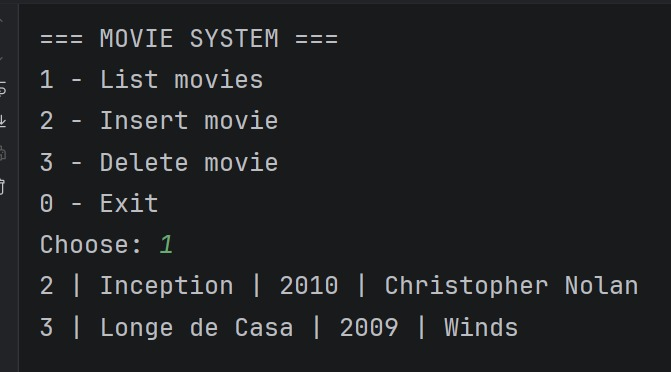

# 🎬 Movie CRUD System (Java + MySQL)

A simple CRUD system built with Java, JDBC, and MySQL.
This project allows users to manage a movie database through a console-based menu system.

---

## 📸 Demo




## 🚀 Features

- 📋 List all movies
- ➕ Add new movies
- ❌ Delete movies by ID
- 🧭 Interactive console menu
- 🔐 Environment variables for database credentials

---

## 🛠️ Technologies Used

- Java
- JDBC (Java Database Connectivity)
- MySQL
- dotenv-java (environment variables)

---

## 📁 Project Structure

- `MovieDatabase` → Main menu system
- `MovieDAO` → Database operations (CRUD)
- `DatabaseConfig` → Database connection handling

---

## ⚙️ Setup Instructions

### 1. Create the database

```sql
CREATE DATABASE moviedb;

USE moviedb;

CREATE TABLE movies (
    id INT AUTO_INCREMENT PRIMARY KEY,
    title VARCHAR(255),
    year INT,
    director VARCHAR(255)
);